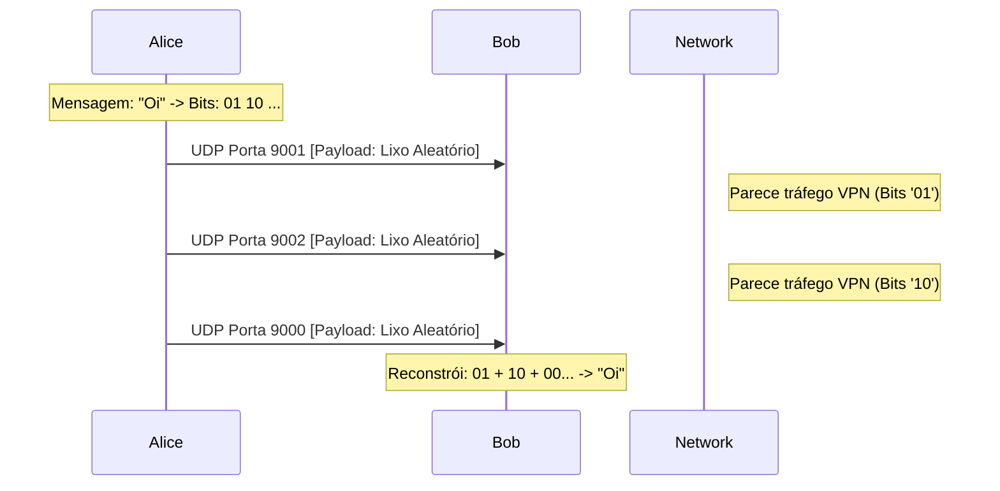
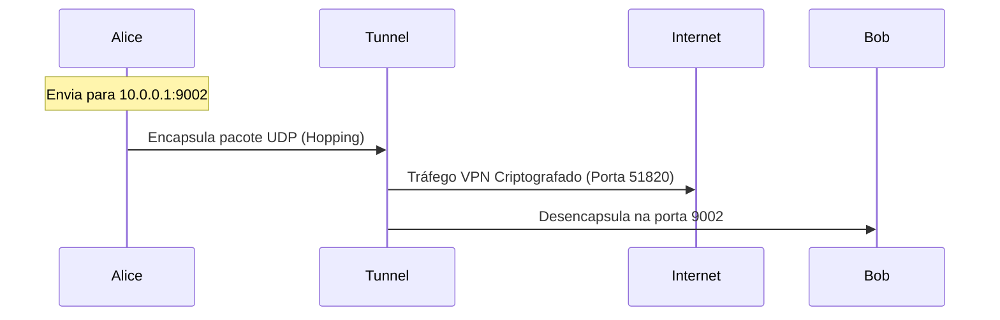

#  FEP INTERSTICE
### Covert Communication Channel via UDP Port Hopping & Bit-Banging


> **⚠️ Aviso Legal (Disclaimer):**
> Este software é uma **Prova de Conceito (PoC)** desenvolvida para pesquisa em esteganografia de rede e canais laterais (Side-Channels). O autor não encoraja o uso desta ferramenta para evadir sistemas de monitoramento em redes corporativas ou governamentais sem autorização.

---

##  Visão Geral

O **FEP INTERSTICE** é uma ferramenta de comunicação encoberta (C2/Chat) que desafia os métodos tradicionais de interceptação. Diferente de chats convencionais que enviam a mensagem dentro do pacote, o Interstice envia **lixo aleatório**.

> **"A invisibilidade é a melhor defesa."**
> O FEP INTERSTICE cria um túnel de comunicação criptografado que se esconde no ruído de fundo da rede, permitindo trocas de mensagens indetetáveis por DPI (Deep Packet Inspection).

##  Objetivo e Capacidades

O projeto foi desenhado para garantir **Confidencialidade** e **Negabilidade** em ambientes monitorizados. Ele resolve dois problemas críticos de chats convencionais:

1.  **Ocultação de Conteúdo:** Diferente de sockets TCP normais, o Interstice não envia texto. Ele envia **Ruído Aleatório**. A mensagem real é a **escolha da porta** (Port Hopping) e o **tempo** (Jitter).
2.  **Resistência a Bloqueio:** Não existe um "Handshake" fixo ou assinatura de protocolo que um Firewall possa bloquear sem causar danos colaterais a tráfego legítimo UDP (como VoIP ou Jogos).

---

A informação real é transmitida através de **Metadados de Transporte**:
1.  **Qual porta** recebeu o pacote? (Codificação Espacial)
2.  **Quando** o pacote chegou? (Codificação Temporal)

Isso torna o tráfego indistinguível de ruído de rede ou falhas de conexão UDP para a maioria dos sistemas de DPI (Deep Packet Inspection).

##  Diagrama de Fluxo



##  Engenharia e Furtividade (OpSec)

### 1. Protocolo de Port Hopping (O Segredo)
A mensagem não viaja no *payload*. Ela é quebrada em bits e mapeada para um salto entre 4 portas UDP.

| Par de Bits | Offset de Porta | Porta Real (Ex: Base 9000) |
| :--- | :--- | :--- |
| **00** | Base + 0 | `9000` |
| **01** | Base + 1 | `9001` |
| **10** | Base + 2 | `9002` |
| **11** | Base + 3 | `9003` |

### 2. Camuflagem de Tráfego (Masquerading)
* **Payload Aleatório:** O conteúdo de cada pacote UDP é gerado via `os.urandom()`. Para um sniffer (Wireshark), parece tráfego criptografado corrompido ou fluxos de jogos/VoIP.
* **Sem Assinaturas:** Não há cabeçalhos de chat, nem texto claro, nem padrões de bytes repetidos.

### 3. Criptografia em Profundidade
* **Nível Lógico:** O texto é cifrado (XOR/Stream Cipher) antes de ser convertido em bits. Mesmo que o padrão das portas seja descoberto, a mensagem permanece ilegível.
* **Nível de Transporte:** O sistema é agnóstico e projetado para rodar dentro de túneis VPN (veja seção WireGuard).

### 4. Dispersão Espectral (A Camada de Transporte)
A comunicação nunca ocorre num único canal.
* **Port Hopping:** O sinal é fragmentado e espalhado por 4 canais de frequência (Portas) diferentes.
* **Vantagem:** Derruba tentativas de "Follow TCP Stream". Para interceptar a conversa, o atacante teria que gravar e correlacionar o tráfego de todas as portas simultaneamente.
---

## 🛠 Instalação

### Pré-requisitos
* Python 3.x
* Acesso de rede (Permissão para abrir sockets UDP)

```bash
# 1. Clonar o repositório
git clone https://github.com/felipeandrian/fep-interstice.git
cd fep-interstice

# 2. (Opcional) Configurar permissões de execução
chmod +x fep_interstice.py
````

-----

##  Modo de Uso (Local / LAN)

O chat opera em modo cruzado. Um lado deve ser **Alice (A)** e o outro **Bob (B)**.

### 1\. Iniciar Lado A (Alice)

Escuta nas portas 9000-9003 e envia para 9004-9007.

```bash
python3 fep_interstice.py
# Escolha Opção 1
# Digite o IP do Bob (ex: 192.168.1.X)
```

### 2\. Iniciar Lado B (Bob)

Escuta nas portas 9004-9007 e envia para 9000-9003.

```bash
python3 fep_interstice.py
# Escolha Opção 2
# Digite o IP da Alice (ex: 192.168.1.Y)
```

-----

## ️ Operação Avançada: Tunelamento via VPN WireGuard

Para operar através da internet sem expor 8 portas no roteador e para adicionar uma camada de criptografia militar, recomenda-se o uso do **WireGuard**.

Isso encapsula o tráfego de *Port Hopping* dentro de um único fluxo UDP (Porta 51820), tornando-o invisível para o ISP.

### Diagrama de Arquitetura VPN



### Guia de Configuração Rápida

#### 1\. Servidor (Hub) - Ex: Windows/Linux

Crie o arquivo `wg0.conf`:

```ini
[Interface]
Address = 10.0.0.1/24
ListenPort = 51820
PrivateKey = [SUA_PRIVATE_KEY]

[Peer]
# Cliente Alice
PublicKey = [PUBKEY_ALICE]
AllowedIPs = 10.0.0.2/32
```

#### 2\. Cliente (Peer) - Ex: WSL/Linux/Phone

Crie o arquivo `client.conf`:

```ini
[Interface]
Address = 10.0.0.2/24
PrivateKey = [PRIVATE_KEY_ALICE]

[Peer]
PublicKey = [PUBKEY_SERVIDOR]
Endpoint = [IP_PUBLICO_DO_SERVIDOR]:51820
AllowedIPs = 10.0.0.0/24  # Roteia apenas a VPN
PersistentKeepalive = 25
```

#### 3\. Executando o FEP INTERSTICE na VPN

Uma vez conectado o WireGuard, execute o script usando os **IPs Internos**:

  * **Alice:** `python3 fep_interstice.py` $\to$ Alvo: `10.0.0.1`
  * **Bob:** `python3 fep_interstice.py` $\to$ Alvo: `10.0.0.2`

-----

## ⌨ Comandos Internos (Slash Commands)

| Comando | Descrição |
| :--- | :--- |
| **/cls** | Limpa a tela e redesenha o banner de segurança (Anti-Shoulder Surfing). |
| **/nick [nome]** | Altera seu codinome na sessão atual. |
| **/quit** | Encerra os sockets e fecha o programa silenciosamente. |

-----

##  Beyond PoC: Roteiro de Hardening (OpSec Avançada)

Embora o FEP INTERSTICE demonstre a eficácia do *Port Hopping*, a implementação atual utiliza primitivas criptográficas simplificadas para fins educativos. Para uma operação real de alta segurança (Grade-4), as seguintes modificações são mandatórias:

### 1. Substituição da Criptografia (De XOR para AES-GCM)
A cifra XOR (`chr ^ key`) utilizada é simétrica e estática. Um analista que capture tráfego suficiente pode realizar um ataque de **Análise de Frequência** ou **Known-Plaintext Attack** para recuperar a chave `0x5A`.

**A Solução:** Implementar o **Protocolo Noise** ou **AES-256-GCM**.
* **Confidencialidade:** AES-256 torna o conteúdo matematicamente impossível de ler sem a chave.
* **Integridade (GCM):** Garante que ninguém alterou os bits do pacote no meio do caminho (Man-in-the-Middle), algo que o XOR não detecta.

### 2. Troca de Chaves Epêmeras (Forward Secrecy)
Atualmente, a chave (`SESSION_KEY`) está *hardcoded* ou é passada via argumento. Se um dispositivo for apreendido, todas as conversas passadas são descriptografadas.

**A Solução:** Implementar **ECDH (Elliptic-Curve Diffie-Hellman)**.
* O chat deve gerar um par de chaves novo a cada sessão.
* **Forward Secrecy:** Se a chave de amanhã for roubada, as mensagens de ontem continuam matematicamente seguras.


### 3. Mimetização de Protocolo (Protocol Mimicry)
O envio de *bytes* puramente aleatórios (`os.urandom`) cria um perfil de **Alta Entropia** constante. Firewalls de Nova Geração (NGFW) podem bloquear fluxos que têm "entropia perfeita" porque não se parecem com tráfego humano.

**A Solução:** Moldar o payload para parecer um protocolo real não bloqueado ou melhor ainda acoplar a tráfego real UDP.
* **VoIP (RTP):** Adicionar cabeçalhos falsos de RTP (Real-time Transport Protocol) no início do pacote UDP. O Firewall pensará que é uma chamada de WhatsApp/Zoom e priorizará o tráfego.
* **DNS:** Se usar a porta 53, formatar o payload como uma *Query DNS* válida.

### 4. Distribuição Estatística de Tempo (Anti-AI)
O `time.sleep(0.02)` cria um padrão rítmico. Algoritmos de IA podem detetar essa "batida de coração" mecânica.

**A Solução:** Usar uma **Distribuição de Poisson** para os atrasos.
* O tempo entre pacotes deve variar organicamente, imitando a digitação humana ou a latência natural da internet, tornando o fluxo invisível para análises estatísticas de tráfego.
-----

## 📄 Licença

Copyright (c) 2025 **Felipe Andrian Peixoto**

Licenciado sob a licença MIT. Consulte o arquivo `LICENSE` para obter mais detalhes.

